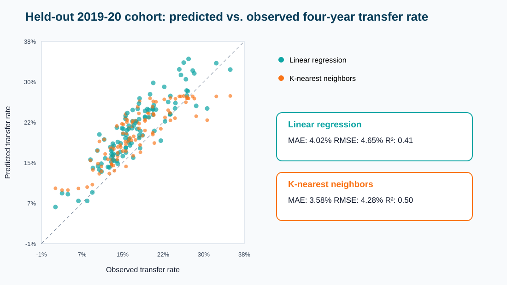
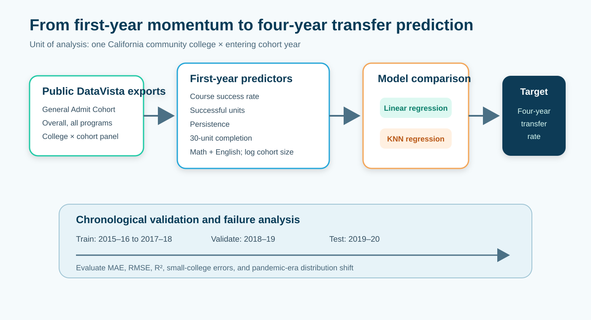

# Predicting four-year transfer outcomes from first-year academic momentum

This repository supports an institutional-level capstone analysis of California Community Colleges. It asks whether a small set of first-year academic momentum indicators can predict the percentage of an entering General Admit cohort that transfers to a four-year institution within four years, and whether a nonlinear supervised-learning method improves on ordinary least squares.

## Main result

On the held-out 2019-20 cohort, linear regression achieved an MAE of 4.02 percentage points and R² of 0.406. K-nearest-neighbors regression achieved an MAE of 3.58 points and R² of 0.497, an 11.1% reduction in MAE. The paired-bootstrap 95% confidence interval for the MAE improvement was 0.11 to 0.79 percentage points.



## Project schematic



## Unit of analysis

One observation is one **college × entering cohort year**. This is not a student-level prediction model and must not be interpreted as predicting an individual student's outcome.

## Data

Source: California Community Colleges Chancellor's Office DataVista, **General Admit Cohort** bulk exports.

Request these settings:

- Data View: `General Admit Cohort`
- Years: `12-13` through `20-21`
- Locale Type: `College`
- Locale: each college
- File format: `CSV`

DataVista currently returns usable General Admit Cohort rows beginning in 2015-16. The four-year transfer target is mature through 2019-20; 2020-21 is retained for first-year descriptive analysis but excluded from four-year model evaluation when its target is absent.

The raw exports are not committed because they are large. Place the `.csv.gz` college exports in `data/raw_gz/`, or pass the downloader's `raw_gz` directory to the analysis command.

## Metrics

| Role | DataVista metric | Timeframe | Field used |
|---|---:|---|---|
| Cohort size control | 122 | 1 year | `VALUE`, transformed with `log1p` |
| Course success | 408 | 1 year | `PERC` |
| Average successful units | 428 | 1 year | `VALUE` |
| Persistence | 453 | 1 year | `PERC` |
| Completed 30+ units | 458 | 1 year | `PERC` |
| Transfer-level math and English | 501 | 1 year | `PERC` |
| Four-year transfer target | 650 | 4 year | `PERC` |

Only overall, all-program rows are retained: `Overall / All` for both disaggregation fields and `All Programs` for program fields.

## Reproduce the analysis

Python 3.9+ and NumPy are required.

```bash
python3 -m pip install -r requirements.txt
python3 analysis.py --input-dir ../datavista_college_exports/raw_gz
```

The analysis writes:

- `data/processed/modeling_panel.csv`
- `results/model_metrics.csv`
- `results/test_predictions.csv`
- `results/standardized_linear_coefficients.csv`
- `results/residual_summary.csv`
- `figures/main_results.svg`

## Validation design

- Development training cohorts: 2015-16 through 2017-18
- Validation cohort: 2018-19, used to choose the KNN neighbor count
- Final training cohorts: 2015-16 through 2018-19
- Held-out test cohort: 2019-20

The split is chronological rather than random, preventing records from later cohort years from informing predictions for earlier years. Models are compared using MAE, RMSE, and R². A paired bootstrap confidence interval for the test-set MAE difference assesses whether any improvement is practically distinguishable from sampling variation across colleges.

## Models

1. Ordinary least squares with standardized predictors.
2. K-nearest-neighbors regression with standardized predictors; `k` is selected on the 2018-19 validation cohort.

KNN is intentionally modest: with only about five mature cohort years, a highly flexible ensemble would be difficult to tune honestly. The comparison asks whether a transparent nonlinear/local method adds useful predictive value beyond the linear baseline.

## Important limitations

- College-level associations do not establish student-level relationships or causal effects.
- Only a small number of mature cohort years are available.
- Pandemic-era cohorts may represent distribution shift.
- Suppression and missingness may disproportionately affect small colleges.
- Institutional differences not captured by the selected momentum metrics can drive residual error.
